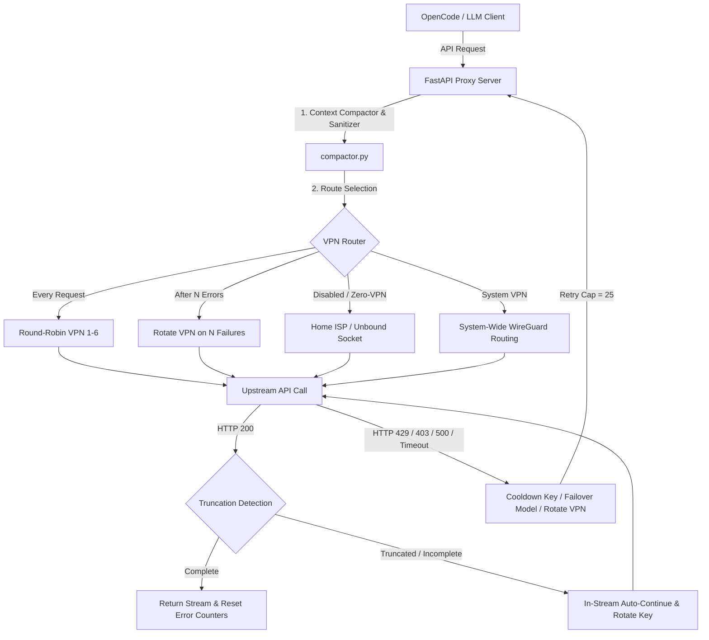

# GeminiProxy 🔄🛡️

[](https://python.org)
[](https://opensource.org/licenses/MIT)
[](#)
[](https://fastapi.tiangolo.com)
[](#)

A resilient, high-performance API proxy and WireGuard VPN rotation gateway designed to bypass rate limits, network timeouts, and provider restrictions. Specifically engineered for free-tier and multi-provider LLM workflows (Gemini, OpenRouter, Mistral, Ollama Cloud, LLM7, OpenCode Zen, Kaggle), featuring in-stream auto-continuation, prompt context compaction, and a modern CustomTkinter GUI dashboard.

---

## 📦 Architecture & Request Flow



---

## ✨ Key Features

| Feature | Description |
| :--- | :--- |
| **Multi-Level Key & Model Rotation** | Dynamically rotates API keys upon rate limits (429) or forbidden errors (403). Automatically fails over to alternative models in rotation queues if all keys for a model are exhausted. |
| **Isolated Multi-Channel WireGuard Routing** | Binds outbound HTTP requests to virtual WireGuard adapters (`10.8.0.11`–`10.8.0.16`) at the socket level without disrupting default Windows internet traffic. |
| **VPS Routing Loop Protection** | Automatically provisions `/32` host routes for the WireGuard VPS endpoint through the physical default gateway (Wi-Fi or Ethernet), preventing handshake packet interception. |
| **In-Stream Auto-Continue** | Detects truncated model responses (even when ending in `STOP` with open delimiters or cut-off sentences) and seamlessly requests continuation in-stream with automated key rotation. |
| **Google History Hardening & Gemini Sanitizer** | Normalizes conversation history, cleans synthetic continuation turns, strips reasoning text while preserving `thoughtSignature` metadata, and repairs merged function-call parts. |
| **Context Compactor** | Strips repetitive system instructions, relocates prompt-cache markers, and filters heavy payloads to conserve tokens. |
| **Portable & Configurable Paths** | Keys directory, VPN switcher folder, and client configuration paths are fully configurable via GUI Settings with native browse dialogs and portable defaults. |
| **Automated Target Migration** | Includes `migrate.cmd` for target PC setup: auto-clones/pulls via Git, provisions virtual environment, verifies WireGuard configs, and validates API keys. |
| **Zero-VPN / Standalone Fallback** | Seamlessly operates in standalone zero-VPN mode if WireGuard is not installed or when run without Administrator privileges. |

---

## 📂 Project Structure

```text
GeminiProxy/
├── migrate.cmd                 # One-command migration & Git pull script for new PCs
├── launch_gui.cmd              # One-click Windows GUI runner
├── proxy3.py                   # Unified CLI & GUI entrypoint
├── config_rotation.json        # Central hot-reloading runtime configuration
├── MIGRATION_GUIDE.md          # Comprehensive PC deployment & WireGuard guide
├── keys/                       # Default directory for API keys (.md or .txt)
│   ├── Google API Keys.md
│   ├── OpenRouter API Keys.md
│   ├── Mistral API Keys.md
│   ├── LLM7 Api Keys.md
│   ├── Ollama Cloud API Keys.md
│   └── Opencode Zen API Keys.md
├── vpn/                        # Project-local WireGuard VPN subsystem
│   ├── vpn_manager.py          # WindowsWireGuardManager service controller
│   ├── forawrd_tunnels.ps1     # Dynamic adapter route injector
│   ├── register.ps1            # Service batch registration
│   ├── unregister.ps1          # Service batch uninstallation
│   ├── test_vpn.py             # Multi-tunnel connectivity & IP tester
│   └── configs/                # WireGuard tunnel configuration files
│       ├── vpn1.conf
│       └── ... (vpn2.conf - vpn6.conf)
├── proxy_core/                 # Core proxy implementation
│   ├── compactor.py            # Context compactor, sanitizer & truncation detector
│   ├── config.py               # Path resolvers & configuration manager
│   ├── gui.py                  # CustomTkinter GUI dashboard & live logs monitor
│   ├── logger.py               # Structured logging pipeline
│   ├── rotation.py             # Key cooldown scheduler, routes & loop protection
│   ├── server.py               # FastAPI server, SSE translator & lifespan manager
│   └── state.py                # Cross-thread shared state
└── test_compactor.py           # Unit tests suite
```

---

## 🚦 Quick Start

### 1. New Machine Setup (`migrate.cmd`)
Clone or copy the repository to your target machine, then run:
```cmd
migrate.cmd
```
This script will:
- Pull latest updates from Git.
- Provision a Python 3.10+ virtual environment (`.venv`) using `uv` or `pip`.
- Verify the local `vpn/` directory and WireGuard tunnel files.
- Automatically point `vpn_switcher_dir` in `config_rotation.json` to the local `vpn` folder.
- Audit configured API key files.

### 2. Configure API Keys
Place your API key Markdown or text files in the `keys/` directory (or specify a custom path in GUI **Settings** -> **Keys Location**):
- `keys/Google API Keys.md`
- `keys/OpenRouter API Keys.md`
- `keys/Mistral API Keys.md`
- `keys/LLM7 Api Keys.md`
- `keys/Ollama Cloud API Keys.md`
- `keys/Opencode Zen API Keys.md`

### 3. Launching the Proxy
- **GUI Dashboard (Recommended):** Double-click `launch_gui.cmd` or run:
  ```cmd
  .venv\Scripts\python.exe proxy3.py --gui
  ```
- **Headless Server:**
  ```cmd
  .venv\Scripts\python.exe proxy3.py --host 127.0.0.1 --port 4000
  ```

---

## ⚙️ Routing & VPN Modes

| Mode | Behavior |
| :--- | :--- |
| **Disabled ("Выкл")** | Runs in standalone zero-VPN mode using standard outbound sockets. Requires no administrator privileges. |
| **Every Request ("Каждый запрос")** | Rotates the outgoing socket IP address in round-robin sequence across active WireGuard adapters (`10.8.0.11`–`10.8.0.16`) before every API call. |
| **After N Errors ("Смена после N ошибок")** | Rotates to the next WireGuard tunnel interface only when $N$ consecutive request errors or timeouts occur on the current channel. |
| **System VPN** | Routes all system internet traffic through a selected tunnel with automatic route stabilization and anti-BSOD protection. |

---

## 🔌 Client Configuration (OpenCode)

Configure OpenCode or any OpenAI/Gemini compatible client in `opencode.jsonc`:

```jsonc
{
  "provider": {
    "gemini": {
      "npm": "@ai-sdk/google",
      "baseURL": "http://127.0.0.1:4000/v1beta",
      "apiKey": "dummy"
    },
    "openrouter": {
      "npm": "@ai-sdk/openai-compatible",
      "baseURL": "http://127.0.0.1:4000/openrouter",
      "apiKey": "dummy"
    }
  }
}
```

For complete multi-machine setup instructions, WireGuard configuration details, and troubleshooting, refer to [`MIGRATION_GUIDE.md`](MIGRATION_GUIDE.md).

---

## 📝 License

Distributed under the MIT License. See `LICENSE` for details.
