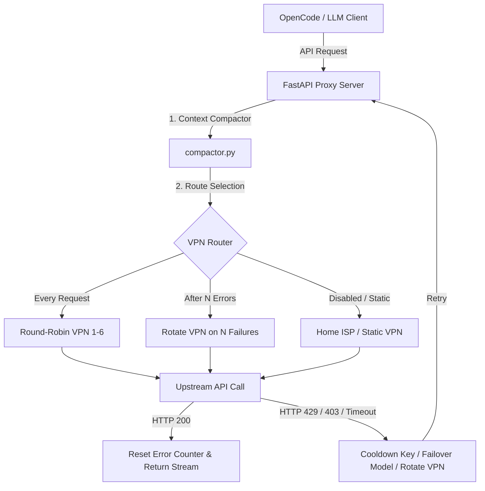

# GeminiProxy 🔄🛡️

[](https://python.org)
[](https://opensource.org/licenses/MIT)
[](#)
[](https://fastapi.tiangolo.com)
[](#)

A resilient, high-performance API proxy and WireGuard VPN rotation gateway designed to bypass rate limits, network timeouts, and provider blocks. Specifically optimized for free-tier LLM providers (Gemini, OpenRouter, Mistral, Ollama), featuring a modern CustomTkinter GUI dashboard and auto-restarting background server.

---

## 📦 Architecture & Request Flow



---

## ✨ Key Features

| Feature | Description | Icons |
| :--- | :--- | :---: |
| **Multi-Level Rotation** | Cycles API keys on rate limits (429) or forbidden errors (403). Automatically falls back to alternative models if all keys are exhausted. | 🔑🔄 |
| **Isolated VPN Routing** | Routes outgoing requests through specific WireGuard interfaces using socket-level binding. System-wide routing remains untouched. | 🛡️🌐 |
| **Context Compactor** | Intercepts and rewrites LLM prompts/responses to strip duplicate instructions and compress schemas, saving up to 90% of context tokens. | 🧹⚡ |
| **Live Diagnostics** | Real-time latency ping tests, active rotation priority queues, and live log viewer built into a CustomTkinter dashboard. | 📊🎛️ |
| **Self-Healing Registry** | Automatically logs failing keys to `error_keys_log.json` and puts them on cooldown (12h for 403). Vindicts keys upon first successful call. | 🩹💖 |
| **Parallel Channels** | Supports up to 7 parallel channels with configurable delays and deterministic key distribution to maximize throughput. | ⚡🔀 |

---

## 📂 Project Structure

```text
GeminiProxy/
├── proxy3.py             # Unified entrypoint (GUI launcher & CLI controller)
├── proxy_core/           # Core proxy implementation
│   ├── compactor.py      # Token compactor & headroom compressor
│   ├── config.py         # Hot-reloading configuration manager
│   ├── gui.py            # CustomTkinter GUI & Live logs monitor
│   ├── logger.py         # Structured system logger
│   ├── rotation.py       # API key manager & cooldown scheduler
│   ├── server.py         # FastAPI ASGI server & payload translator
│   └── state.py          # Thread-safe cross-module state
├── config_rotation.json  # Hot-reloaded runtime configuration
├── launch_gui.cmd        # One-click Windows runner (powered by uv)
├── app.ico               # GUI application icon
└── test_compactor.py     # Unit tests for context compactor
```

---

## 🚦 Quick Start

### 1. Configure API Keys
Set your API key file paths in `proxy_core/rotation.py` (supports plain text or Markdown lists):
```python
KEYS_FILE_PATH = r"path/to/your/Google API Keys.md"
OPENROUTER_KEYS_FILE = r"path/to/your/OpenRouter API Keys.md"
```

### 2. Launch the Proxy

*   **One-Click (Windows):** Double-click `launch_gui.cmd` to run via `uv` automatically.
*   **GUI Mode:** `uv run proxy3.py --gui`
*   **Headless CLI Mode:** `uv run proxy3.py --host 127.0.0.1 --port 4000`

---

## ⚙️ Routing & VPN Modes

*   **Disabled ("Выкл"):** Uses default home ISP or a static VPN index.
*   **Every Request ("Каждый запрос"):** Rotates the outgoing socket IP address in a round-robin fashion across active WireGuard adapters (Indexes 1-6) before every API call.
*   **After N Errors ("Смена после N ошибок"):** Rotates VPN socket instantly when $N$ consecutive request failures or timeouts occur.

---

## 🛠️ Context Compaction & Interception

*   **Deduplication:** Strips repetitive system instructions and redundant tool schemas.
*   **Headroom Integration:** Employs the `headroom` library to compress long tool outputs and search results.
*   **Surgical Reading Guardrail:** Prevents generic full-file reads on code, enforcing token-efficient outline and signature modes.
*   **Internal Reminder Relocation:** Moves `<internal_reminder>` blocks to system instructions to optimize prompt caching.

---

## 📝 License

Distributed under the MIT License. See `LICENSE` for details.
