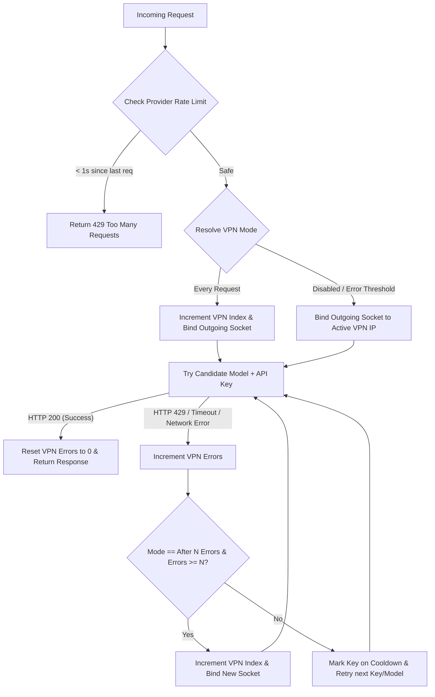

# RotationProxy (GeminiProxy) 🔄🛡️

A resilient, high-performance API key, model, and isolated VPN rotation proxy designed to bypass rate limits (429s), key exhaustions, network timeouts, and provider blocks seamlessly. Optimized for **free-tier** models from Gemini, OpenRouter, and Mistral, the proxy includes a modern **CustomTkinter GUI** that runs the FastAPI server as an auto-restarting background subprocess with live diagnostics.

---

## 🚀 Key Features

### 🛡️ 1. Multi-Level Key & Model Rotation
- **Robust Key Rotation & Cooldowns**: Cycles through your list of API keys. If a key hits a rate limit (429) or fails, it is placed on a cooldown while the proxy immediately retries the request using the next available key.
- **Failover Model Rotation**: If all keys for a requested model are exhausted or rate-limited, the proxy automatically falls back to alternative free models in its rotation list (e.g., DeepSeek v4 Flash, Kimi K2.6, Llama 3.3, Qwen 3 Coder, etc.) to guarantee high availability.
- **Self-Healing Key Registry**: Bad keys are logged to `error_keys_log.json`. However, as soon as a key successfully processes a request (HTTP 200), it is automatically cleared and vindicated from the error log.

### 🔌 2. WireGuard VPN Tunnel Manager (Isolated Socket Routing)
- **Isolated Socket-Level Routing**: Outgoing API requests are routed through specific VPN indexes using **socket-level local address binding**. The system-wide routing table is **never** modified! Your browser, games, and other apps stay on your default home ISP, while *only* the proxy's API requests go through the VPN.
- **Multi-Client Connection Pool**: FastAPI initializes 7 pre-configured `httpx.AsyncClient` instances on startup. Client `0` uses your home ISP, while clients `1` to `6` bind their sockets to the local IPs of active WireGuard interfaces (`10.8.0.11` through `10.8.0.16`).
- **Dynamic Routing Modes**:
  - **Disabled ("Выкл")**: Outgoing requests use your home internet, or bind to a manual static VPN index (1-6) on demand.
  - **Every Request ("Каждый запрос")**: Automatically rotates the outgoing socket IP address in a round-robin fashion before every single API call (Indexes 1-6).
  - **After N Errors ("Смена после N ошибок")**: Tracks consecutive errors (429s, network timeouts) and rotates client socket IP instantly when the user-defined threshold $N$ is reached, retrying immediately with no sleep.
- **Activity Status Polling**: On the GUI, a visual indicator (**🟢 VPN Active** / **🔴 VPN Inactive**) polls the state of the Windows WireGuard background services every 5 seconds.
- **Auto-Cleanup on Close**: When the GUI is closed, it automatically stops and uninstalls all background WireGuard services (`uninstall_all_services()`) to leave Windows completely clean.

### 🎛️ 3. Model Manager Hub & Diagnostics
- **Live Diagnostics Monitor**: Dynamic scanning of free models from OpenRouter. Features real-time latency ping tests (e.g., `● 142ms`) and status indicators (**🟢 OK**, **🟡 Testing**, **🟠 429**, **🔴 404/Error**).
- **Active Rotation Configurator**: Interactive priority queue manipulation with up/down arrows (▲/▼) and removal (✕) for both **Thinking** (`gemini-3.5-flash`) and **Quick** (`gemini-flash-lite-latest`) domains.
- **Hot-Reloading Configurations**: Any changes saved to `config_rotation.json` are automatically hot-reloaded on the next request without server restarts!

### 📈 4. Bidirectional Streaming & Translation Engine
- **Stream Translation**: Complete bidirectional translation between OpenAI chunk formats and Gemini response formats.
- **Graceful Stream Termination**: Catches and logs upstream read errors (`httpx.ReadError`, `httpcore.ReadError`) gracefully during streaming, preventing ASGI crashes and stack traces from prematurely aborted client connections.
- **UTF-8 Subprocess Stream Encoding**: Forces all subprocess streams to use UTF-8 (`PYTHONIOENCODING=utf-8`), resolving Windows-specific encoding conflicts and preventing corrupted characters (mojibake) in GUI logs.

---

## 📂 Project Structure

```text
GeminiProxy/
├── proxy3.py             # Unified proxy server and GUI controller
├── proxy_core/
│   ├── __init__.py
│   ├── config.py         # Schema upgrades, path resolutions, and configuration
│   ├── gui.py            # CTkTabview GUI, multithreaded VPN & model manager, live logs
│   ├── logger.py         # Console and file logger configurations
│   ├── rotation.py       # API key loader and cooldown scheduler
│   ├── server.py         # FastAPI ASGI server, socket routing, 429 handlers, payload translations
│   └── state.py          # Shared cross-module thread-safe states and queues
├── config_rotation.json  # Model rotation lists and dynamic settings
├── launch_gui.cmd        # One-click Windows launcher using uv
├── app.ico               # GUI Window application icon
├── .gitignore            # Git exclusion rules for caches, keys, and logs
└── docs/                 # Detailed implementation plans and architectural designs
```

---

## 🚦 Quick Start

### 1. Configure Your API Keys
To protect your keys from accidentally leaking into git, configure your keys list file paths in `proxy_core/rotation.py`:

```python
KEYS_FILE_PATH = r"path/to/your/Google API Keys.md"
OPENROUTER_KEYS_FILE = r"path/to/your/OpenRouter API Keys.md"
MISTRAL_KEYS_FILE = r"path/to/your/Mistral API Keys.md"
LLM7_KEYS_FILE = r"path/to/your/LLM7 Api Keys.md"
```

*Note: Your key files can be simple text or Markdown lists where keys are listed line-by-line (e.g., prefixing lines with `- ` or `* ` is supported).*

### 2. Run the Application

#### A. One-Click Launcher (Windows)
Double-click `launch_gui.cmd` to instantly start the GUI with all dependencies handled on the fly via `uv`.

#### B. Manual CLI Start

Start the **GUI Mode** (which spawns the background server):
```bash
uv run proxy3.py --gui
```

Start the **Headless Proxy Server Only**:
```bash
uv run proxy3.py --host 127.0.0.1 --port 4000
```

---

## ⚙️ Configuration (`config_rotation.json`)

You can define which free models act as failovers for each other in `config_rotation.json`:

- **`gemini-3.5-flash`** (Thinking Rotation List):
  - Primary: `gemini-3.5-flash`
  - Fallbacks: `openrouter/owl-alpha`, `deepseek/deepseek-v4-flash:free`, `meta-llama/llama-3.3-70b-instruct:free`, `qwen/qwen3-coder:free`, `moonshotai/kimi-k2.6:free`
- **`gemini-flash-lite-latest`** (Fast/Lite Rotation List):
  - Primary: `gemini-flash-lite-latest`
  - Fallbacks: `deepseek/deepseek-v4-flash:free`, `liquid/lfm-2.5-1.2b-thinking:free`, `liquid/lfm-2.5-1.2b-instruct:free`, `nvidia/nemotron-nano-9b-v2:free`, `z-ai/glm-4.5-air:free`, `meta-llama/llama-3.2-3b-instruct:free`, `qwen/qwen3-coder:free`

The GUI dropdown lets you override the primary model order instantly, moving your preferred model to the top priority of the rotation list on the fly.

---

## 🛡️ Robust Cooldown & Isolated Routing Flow



---

## 📝 License

Distributed under the MIT License. See `LICENSE` for more information.
