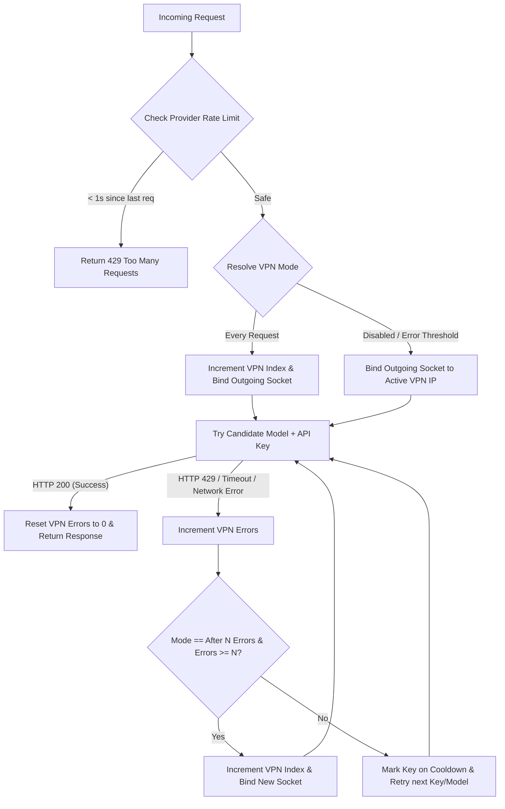

# RotationProxy (GeminiProxy) 🔄🛡️

A resilient, high-performance API key, model, and isolated VPN rotation proxy designed to bypass rate limits (429s), key exhaustions, network timeouts, and provider blocks seamlessly. Optimized for **free-tier** models from Gemini, OpenRouter, and Mistral, the proxy includes a modern **CustomTkinter GUI** that runs the FastAPI server as an auto-restarting background subprocess with live diagnostics.

---

## 🚀 Key Features

### 🛡️ 1. Multi-Level Key & Model Rotation
- **Robust Key Rotation & Cooldowns**: Cycles through your list of API keys. If a key hits a rate limit (429) or fails, it is placed on a cooldown while the proxy immediately retries the request using the next available key.
- **Failover Model Rotation**: If all keys for a requested model are exhausted or rate-limited, the proxy automatically falls back to alternative free models in its rotation list (e.g., DeepSeek v4 Flash, Kimi K2.6, Llama 3.3, Qwen 3 Coder, etc.) to guarantee high availability.
- **Self-Healing Key Registry**: Bad keys are logged to `error_keys_log.json`. However, as soon as a key successfully processes a request (HTTP 200), it is automatically cleared and vindicated from the error log.
- **Ollama Dynamic Routing**: Dynamically registers and routes Ollama models (e.g., `ollama/minimax-m3` or `ollama_cloud/...`) to prevent them from being misrouted to OpenRouter.
- **Manual Cooldown Bypass**: Cooldown checks are bypassed entirely for manual model selection or when model rotation is disabled (`enable_model_rotation = False`).
- **Critical Safety Stop**: Implemented a server-wide safety stop (`track_and_check_safety_limit`) that immediately shuts down the server process if more than 3 model/server errors occur within a rolling 2.0-second window, preventing infinite error loops.

### 🔌 2. WireGuard VPN Tunnel Manager & Health Check
- **Isolated Socket-Level Routing**: Outgoing API requests are routed through specific VPN indexes using **socket-level local address binding**. The system-wide routing table is **never** modified! Your browser, games, and other apps stay on your default home ISP, while *only* the proxy's API requests go through the VPN.
- **Multi-Client Connection Pool**: FastAPI initializes 7 pre-configured `httpx.AsyncClient` instances on startup. Client `0` uses your home ISP, while clients `1` to `6` bind their sockets to the local IPs of active WireGuard interfaces (`10.8.0.11` through `10.8.0.16`).
- **Dynamic Routing Modes**:
  - **Disabled ("Выкл")**: Outgoing requests use your home internet, or bind to a manual static VPN index (1-6) on demand.
  - **Every Request ("Каждый запрос")**: Automatically rotates the outgoing socket IP address in a round-robin fashion before every single API call (Indexes 1-6).
  - **After N Errors ("Смена после N ошибок")**: Tracks consecutive errors (429s, network timeouts) and rotates client socket IP instantly when the user-defined threshold $N$ is reached, retrying immediately with no sleep.
- **VPN Heartbeat & Route Recovery**: A 1.0s background heartbeat loop checks each VPN channel. If a channel goes down, it automatically runs a fast, non-blocking PowerShell route recovery and service restart with adapter polling.
- **Service-State Awareness**: The heartbeat loop checks which WireGuard services are actually running in the system first, skipping checks for stopped or uninstalled tunnels to prevent false alarms.
- **Transition Grace Period & Fallback**: If all tunnels are stopped, the proxy instantly falls back to the unbound client (index 0) and suspends VPN rotation. A 5-second network stabilization grace period allows Windows to restore the physical default route.
- **Auto-Cleanup on Close**: When the GUI is closed, it automatically stops and uninstalls all background WireGuard services (`uninstall_all_services()`) to leave Windows completely clean.

### 🎛️ 3. Model Manager Hub & Diagnostics
- **Live Diagnostics Monitor**: Dynamic scanning of free models from OpenRouter. Features real-time latency ping tests (e.g., `● 142ms`) and status indicators (**🟢 OK**, **🟡 Testing**, **🟠 429**, **🔴 404/Error**).
- **Active Rotation Configurator**: Interactive priority queue manipulation with up/down arrows (▲/▼) and removal (✕) for both **Thinking** (`gemini-3.5-flash`) and **Quick** (`gemini-flash-lite-latest`) domains.
- **Hot-Reloading Configurations**: Any changes saved to `config_rotation.json` are automatically hot-reloaded on the next request without server restarts!

### 📈 4. Bidirectional Streaming & Translation Engine
- **Stream Translation**: Complete bidirectional translation between OpenAI chunk formats and Gemini response formats.
- **Graceful Stream Termination**: Catches and logs upstream read errors (`httpx.ReadError`, `httpcore.ReadError`) gracefully during streaming, preventing ASGI crashes and stack traces from prematurely aborted client connections.
- **UTF-8 Subprocess Stream Encoding**: Forces all subprocess streams to use UTF-8 (`PYTHONIOENCODING=utf-8`), resolving Windows-specific encoding conflicts and preventing corrupted characters (mojibake) in GUI logs.

### 📊 5. MCP Tools & Usage Analyzer
- **History-Aware Analysis**: A highly robust analysis script `tools/analyze_mcp_tools.py` recursively scans all chat logs (`*_request.txt` and `*_response.txt` files) across all session subdirectories.
- **Accurate Call Counting**: Uses a smart deduplication algorithm to count the exact number of times each tool was called in `functionCall` blocks across the entire history, with zero double-counting.
- **JSON Repair & Fallback**: Features a robust JSON repair function that automatically fixes invalid escape sequences (such as backslashes followed by newlines or unescaped Windows paths) and falls back to regex-based parsing if needed, ensuring 100% data extraction.
- **Detailed Grouping**: Groups tools by their MCP server/block and calculates description and full JSON sizes (in characters and KB).

### ⚡ 6. Active Parallelism & Load Balancing
- **Configurable Parallel Channels**: Supports running 1 to 7 parallel channels with numeric delay entry, load-balancing requests across active slots.
- **Deterministic Key Distribution**: Maps active channels to different API keys from the pool, ensuring that parallel channels use different keys and avoid concurrent request limits.
- **Automatic Slot Rotation**: Automatically rotates failed slots to backup channels if errors occur.

### 🧹 7. Context Compactor & Interception
- **Automatic Context Compaction**: Runs an active compactor (`proxy_core/compactor.py`) that intercepts and rewrites tool responses to minimize context tokens.
- **Deduplication & Schema Compaction**: Strips duplicate system instructions, repetitive skill blocks, and dynamically compacts MCP tool descriptions to their bare minimum required schema.
- **Surgical Reading Guardrail**: Automatically blocks generic `read` calls on code or structured files, forcing the use of token-efficient `smart_read` outline/signatures modes.
- **Headroom Context Compression**: Integrates the `headroom` library to compress long tool outputs, file contents, and search results to save context window space, with strict size verification to ensure compressed content is only used if it is actually shorter than the original.
- **Tiktoken Token Statistics**: Uses `tiktoken` to calculate exact token metrics (input from OpenCode, after local compaction, and after headroom compression) and logs detailed savings statistics (in KB and tokens).
- **Dynamic Monkey-Patching & Safety**: Includes robust monkey-patches for `headroom` (pure Python regex detector bypass to avoid Rust detect_content_type hangs, unknown language handling gracefully, and disabling slow ONNX-based model loading/inference) and `tree_sitter` (SafeParserWrapper to handle bytes vs str gracefully).
- **Tool Guardrails Injection**: Surgically injects strict tool guardrails into the system prompt to enforce optimized tools (e.g., `tokensave` and `lean-ctx`) and prevent the use of restricted generic tools.
- **Internal Reminder Relocation**: Extracts `<internal_reminder>` blocks from user/assistant messages and appends them to the system instruction to preserve prompt caching.

### 🇷🇺 8. Cyrillic Output & Russian Windows Compatibility
- **UTF-8 Transcoding**: Configures all PowerShell and cmd output captures to set console encoding to UTF-8 and decode using UTF-8 with fallback, ensuring 100% compatibility with Russian Windows system language.

---

## 📂 Project Structure

```text
GeminiProxy/
├── proxy3.py             # Unified proxy server and GUI controller
├── proxy_core/
│   ├── __init__.py
│   ├── compactor.py      # Context compactor and tool response interceptor
│   ├── config.py         # Schema upgrades, path resolutions, and configuration
│   ├── gui.py            # CTkTabview GUI, multithreaded VPN & model manager, live logs
│   ├── logger.py         # Console and file logger configurations
│   ├── rotation.py       # API key loader and cooldown scheduler
│   ├── server.py         # FastAPI ASGI server, socket routing, 429 handlers, payload translations
│   └── state.py          # Shared cross-module thread-safe states and queues
├── tools/                # Auxiliary scripts, reports, and analysis tools (git-ignored)
│   ├── analyze_mcp_tools.py # MCP tools declarations and call frequencies analyzer
│   ├── analyze_duplicates.py # Duplicate detection and text state machine
│   ├── analyze_logs.py   # Chat logs parser and metadata filter
│   ├── analyze_session_context.py # Session context and request file analyzer
│   └── strip_conversation.py # Conversational text stripper from request JSON
├── config_rotation.json  # Model rotation lists and dynamic settings
├── launch_gui.cmd        # One-click Windows launcher using uv
├── app.ico               # GUI Window application icon
├── .gitignore            # Git exclusion rules for caches, keys, logs, and tools
└── docs/                 # Detailed implementation plans and architectural designs
```

---

## 🚦 Quick Start

### 1. Configure Your API Keys
To protect your keys from accidentally leaking into git, configure your keys list file paths in `proxy_core/rotation.py`:

```python
KEYS_FILE_PATH = r"path/to/your/Google API Keys.md"
OPENROUTER_KEYS_FILE = r"path/to/your/OpenRouter API Keys.md"
MISTRAL_KEYS_FILE = r"path/to/your/Mistral API Keys.md"
LLM7_KEYS_FILE = r"path/to/your/LLM7 Api Keys.md"
```

*Note: Your key files can be simple text or Markdown lists where keys are listed line-by-line (e.g., prefixing lines with `- ` or `* ` is supported).*

### 2. Run the Application

#### A. One-Click Launcher (Windows)
Double-click `launch_gui.cmd` to instantly start the GUI with all dependencies handled on the fly via `uv`.

#### B. Manual CLI Start

Start the **GUI Mode** (which spawns the background server):
```bash
uv run proxy3.py --gui
```

Start the **Headless Proxy Server Only**:
```bash
uv run proxy3.py --host 127.0.0.1 --port 4000
```

---

## ⚙️ Configuration (`config_rotation.json`)

You can define which free models act as failovers for each other in `config_rotation.json`:

- **`gemini-3.5-flash`** (Thinking Rotation List):
  - Primary: `gemini-3.5-flash`
  - Fallbacks: `openrouter/owl-alpha`, `deepseek/deepseek-v4-flash:free`, `meta-llama/llama-3.3-70b-instruct:free`, `qwen/qwen3-coder:free`, `moonshotai/kimi-k2.6:free`
- **`gemini-flash-lite-latest`** (Fast/Lite Rotation List):
  - Primary: `gemini-flash-lite-latest`
  - Fallbacks: `deepseek/deepseek-v4-flash:free`, `liquid/lfm-2.5-1.2b-thinking:free`, `liquid/lfm-2.5-1.2b-instruct:free`, `nvidia/nemotron-nano-9b-v2:free`, `z-ai/glm-4.5-air:free`, `meta-llama/llama-3.2-3b-instruct:free`, `qwen/qwen3-coder:free`

The GUI dropdown lets you override the primary model order instantly, moving your preferred model to the top priority of the rotation list on the fly.

---

## 🛡️ Robust Cooldown & Isolated Routing Flow



---

## 📝 License

Distributed under the MIT License. See `LICENSE` for more information.
