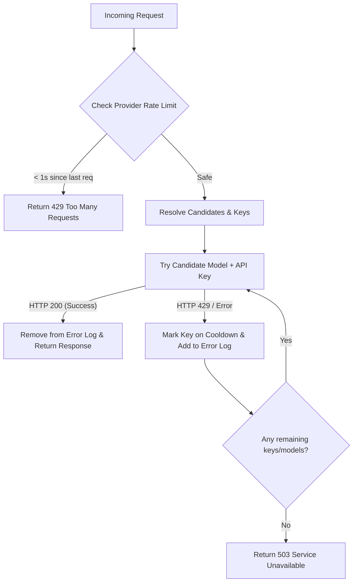

# RotationProxy (GeminiProxy) 🔄🛡️

A resilient, high-performance API key and model rotation proxy designed to bypass rate limits (429s), key exhaustions, and provider failures seamlessly. Optimized for **free-tier** models from Gemini, OpenRouter, and Mistral, the proxy includes a modern **CustomTkinter GUI** that runs the FastAPI server as an auto-restarting background subprocess.

---

## 🚀 Key Features

- **Robust Key Rotation & Cooldowns**: Cycles through your list of API keys. If a key hits a rate limit (429) or fails, it is placed on a cooldown while the proxy immediately retries the request using the next available key.
- **Failover Model Rotation**: If all keys for a requested model are exhausted or rate-limited, the proxy automatically falls back to alternative free models in its rotation list (e.g., DeepSeek R1 Free, Qwen 2.5, Llama 3.3, etc.) to guarantee high availability.
- **Modern CustomTkinter GUI**:
  - Launches in the background with a beautiful, modern interface.
  - Redirects and captures stdout/stderr in real-time to a scrollable log.
  - Provides dropdown selectors to quickly prioritize a specific model.
  - Features quick-toggle for Kaggle proxy URLs.
- **Auto-Restarting Subprocess Controller**: The GUI monitors the FastAPI proxy server health every 1,000ms. If the server exits or crashes, the event is logged to `proxy_errors.log` and the server is restarted automatically.
- **Global Provider Rate Limiting**: Enforces a strict maximum of **1 request per second per provider** (OpenRouter, Mistral, etc.) at the proxy level to prevent aggressive rate limits or bans, returning a clean 429 response if violated.
- **Self-Healing Key Registry**: Bad keys are logged to `error_keys_log.json`. However, as soon as a key successfully processes a request (HTTP 200), it is automatically cleared and vindicated from the error log.
- **Configurable Rotation Lists**: Easily modify model groupings and fallbacks in `config_rotation.json`.
- **Fast and Modern Dev Stack**: Uses `FastAPI`, `Uvicorn`, `httpx`, and Astral's ultra-fast `uv` package manager.

---

## 🛠️ Tech Stack & Requirements

- **Runtime**: Python 3.12+
- **Framework**: FastAPI, Uvicorn, Starlette
- **HTTP Client**: httpx
- **GUI**: CustomTkinter
- **Package Manager**: [uv](https://github.com/astral-sh/uv) (recommended)

---

## 📂 Project Structure

```text
GeminiProxy/
├── proxy3.py             # Unified proxy server and GUI controller
├── config_rotation.json  # Model rotation lists and dynamic settings
├── launch_gui.cmd        # One-click Windows launcher using uv
├── app.ico               # GUI Window application icon
├── .gitignore            # Git exclusion rules for caches, keys, and logs
└── docs/                 # Implementation plans, architectural specs & designs
```

---

## 🚦 Quick Start

### 1. Configure Your API Keys
To protect your keys from accidentally leaking into git, the proxy loads keys from external files configured inside `proxy3.py`. Update these paths to point to your keys list:

```python
KEYS_FILE_PATH = r"path/to/your/Google API Keys.md"
OPENROUTER_KEYS_FILE = r"path/to/your/OpenRouter API Keys.md"
MISTRAL_KEYS_FILE = r"path/to/your/Mistral API Keys.md"
```

*Note: Your key files can be simple text or Markdown lists where keys are listed line-by-line (e.g., prefixing lines with `- ` or `* ` is supported).*

### 2. Run the Application

#### A. One-Click Launcher (Windows)
Double-click `launch_gui.cmd` to instantly start the GUI with all dependencies handled on the fly via `uv`.

#### B. Manual CLI Start

Start the **GUI Mode** (which spawns the background server):
```bash
uv run proxy3.py --gui
```

Start the **Headless Proxy Server Only**:
```bash
uv run proxy3.py --host 127.0.0.1 --port 8000
```

---

## ⚙️ Configuration (`config_rotation.json`)

You can define which free models act as failovers for each other:

- **`gemini-3.5-flash`** (Thinking Rotation List):
  - Primary: `gemini-3.5-flash`
  - Fallbacks: `deepseek/deepseek-r1:free`, `qwen/qwen-2.5-72b-instruct:free`, `meta-llama/llama-3.3-70b-instruct:free`, `deepseek/deepseek-chat:free`
- **`gemini-flash-lite-latest`** (Fast/Lite Rotation List):
  - Primary: `gemini-flash-lite-latest`
  - Fallbacks: `deepseek-v4-flash-free`, `mimo-v2.5-free`, `nemotron-3-super-free`, `google/gemini-2.5-flash:free`, `meta-llama/llama-3.1-8b-instruct:free`, `qwen/qwen-2.5-coder-32b-instruct:free`

The GUI dropdown lets you override the primary order, moving your preferred fallback to the top priority of the rotation list instantly.

---

## 🛡️ Robust Error Handling & Cooldown Flow



- **Cooldown Duration**: A key that encounters a rate-limiting failure is put on a 90-second cooldown (configurable via `RETRY_DELAY_SECONDS`).
- **Graceful Failures**: If a provider is completely down or rate-limited, the request falls back seamlessly to alternative providers and free models in the rotation list.

---

## 📝 License

Distributed under the MIT License. See `LICENSE` for more information.
